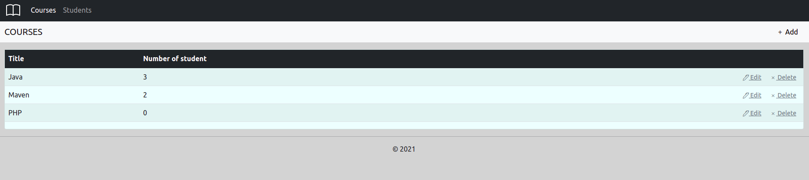
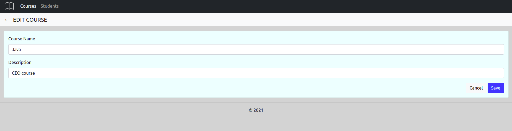

**Факультатив**
Требуется WEB приложение для работы с курсами и записями пользователей на эти курсы.

Приложение должно реализовывать следующие функции:
- Просмотр списка курсов и редактирование этих курсов
- Запись на эти курсы
- Просмотр списка записавшихся студентов
- Фильтрацию студентов по дате рождения 

1. **Курсы**
**1.1 Просмотр списка курсов**
Данный режим предназначен для просмотра списков курсов и количество студентов, записавшихся на эти курсы.

- Пользователь выбирает пункт **COUESES**.
- Отображается форма просмотра списка всех курсов.

Рис. 1.1 Просмотр списка ролей

В списке отображены следующие колонки

- Title – наименование курсов;
- Number of student – количество студентов записанных на данный курс;

**1.2 Добавление роли**
Основной сценарий:
- Пользователь находясь в режиме просмотра списка курсов нажимает кнопку “Add”;
- Отображается форма добавления нового курса;
- Пользователь вводит данные и нажимает кнопку “Save”;
- Если данные введены не корректно, то отображается предупреждение о некорректных данных;
- Если данные корректны, то курс добавляется в базу данных;
- Если произошла ошибка сохранения данных, то выводится сообщение об ошибке: “Ошибка сохранения данных”;
- Если курс успешно добавлена, то открывается форма просмотра списка курсов с обновленными данными.

Отмена изменений:
- Пользователь находясь в режиме просмотра списка курсов нажимает кнопку “Add”;
- Отображается форма добавления нового курса;
- Пользователь вводит данные и нажимает кнопку “Cancel”;
- Данные не сохраняются в базу данных и открывается форма просмотра списка ролей с обновленными данными.

Рис. 1.2 Добавление курса

При добавлении курса вводятся следующие реквизиты:
- Course name – тема курса.
- Description – описание курсы.

**1.3. Редактирование роли**
Основной сценарий:
- Пользователь находясь в режиме просмотра списка курсов нажимает кнопку “Edit” в строке выбранного курса;
- Отображается форма редактирования;
- Пользователь изменяет данные и нажимает кнопку “Save”;
- Если произошла ошибка сохранения данных, то выводится сообщение об ошибке;
- Если курс успешно обновлена, то открывается форма просмотра списка курсов с обновленными данными.

Отмена изменений:
- Пользователь находясь в режиме просмотра списка курсов нажимает кнопку “Правка” в строке выбранной роли;
- Отображается форма редактирования;
- Пользователь вводит данные и нажимает кнопку “Cancel”;
- Данные не сохраняются в базу данных и открывается форма просмотра списка курсов с обновленными данными.

Рис 1.3 Редактирование курса.

При редактировании курса вводятся следующие реквизиты:
`         `● Course name – тема курса.

`         `● Description – описание курсы.

**1.4. Удаление курса
Основной сценарий:**
`       `● Пользователь находясь в режиме просмотра списка курсов нажимает кнопку “Delete” в
строке выбранного пользователя;
`       `● Идет проверка на возможность удаления курса, т.е. не используется ли данный курс каким
нибудь студентами.
`       `● Если курс уже используется, то выдается диалог предупреждения.
`       `● Если курс можно удалить, то отображается диалог подтверждения на удаление.
`       `● Пользователь нажимает кнопку “Delete”;
`       `● Происходит удаление курс в базе данных;
`       `● Если произошла ошибка удаления данных, то выводится сообщение об ошибке.
`       `● Если курс успешно удалена, то открывается форма просмотра списка курсов с обновленными данными.

**Сценарий отмены удаления:**
`       `● Пользователь находясь в режиме просмотра курсов нажимает кнопку “Delete” в
строке выбранной роли;
`      `● Отображается диалог подтверждения на удаление.
`       `● Пользователь нажимает кнопку “Cancel”;
`       `● Открывается форма просмотра списка курсов с обновленными данными.

**2.1. Просмотр списка пользователей**
Данный режим программы предназначен для просмотра списка студентов.
Основной сценарий:
`       `● Пользователь выбирает пункт меню «Students».
`       `● Отображается форма просмотра списка всех пользователей.

Рис. 2.1 Просмотр списка пользователей

В списке отображаются следующие колонки:
`       `● Course name – имя курсы;

`       `● Name – имя студента;
`       `● Email – адрес электронной почты студента;

`       `● Course Number – номер курса студента;

`       `● Data of birth – дата рождения студента;.
В конце списка отображается общее блок фильтрации студентов по дате рождения.

**2.2. Добавление пользователя
Основной сценарий:**
`       `● Пользователь находясь в режиме просмотра списка студентов нажимает кнопку
“Add”;
`       `● Отображается форма добавления нового студента;
`       `● Пользователь вводит данные и нажимает кнопку “Save”;
`       `● Если данные введены не корректно, то отображается предупреждение о некорректных
данных;
`       `● Если данные корректны, то пользователь добавляется в базу данных;
`       `● Если произошла ошибка сохранения данных, то выводится сообщение об ошибке;
`       `● Если пользователь успешно добавлен, то открывается форма просмотра списка пользователей с обновленными данными.

**Отмены изменений:**
`       `● Пользователь находясь в режиме просмотра списка пользователей нажимает кнопку
“Add”;
`       `● Отображается форма добавления нового пользователя;
`       `● Пользователь вводит данные и нажимает кнопку “Cancel”;
`       `● Данные не сохраняются в базу данных и открывается форма просмотра списка пользователей с обновленными данными.

Рис. 2.2 Добавление пользователя
При добавлении пользователя вводятся следующие реквизиты:
`       `● Course – имя курсы;

`       `● Student name – имя студента;
`       `● Email – адрес электронной почты студента;

`       `● Course Number – номер курса студента;

`       `● Data of birth – дата рождения студента;.

**2.3. Редактирование пользователя
Основной сценарий:**
`       `● Пользователь находясь в режиме просмотра списка пользователей нажимает кнопку “Edit” в строке выбранного пользователя;
`       `● Отображается форма редактирования;
`       `● Пользователь изменяет данные и нажимает кнопку “Save”;
`       `● Если данные введены не корректно, то отображается предупреждение о некорректных
данных;
`       `● Если данные корректны, то данные обновляются в базе данных;
`       `● Если произошла ошибка сохранения данных, то выводится сообщение об ошибке; 
`       `● Если пользователь успешно обновлен, то открывается форма просмотра списка пользователей с обновленными данными.

**Отмены изменений:**
`       `● Пользователь находясь в режиме просмотра списка пользователей нажимает кнопку “Edit” в строке выбранного пользователя;
`       `● Отображается форма редактирования;
`       `● Пользователь вводит данные и нажимает кнопку “Cancel”;
`       `● Данные не сохраняются в базу данных и открывается форма просмотра списка пользователей с обновленными данными.

Рис. 2.3 Редактирование пользователя

При редактировании пользователя вводятся следующие реквизиты:
`       `● Course – имя курсы;

`       `● Student name – имя студента;
`       `● Email – адрес электронной почты студента;

`       `● Course Number – номер курса студента;

`       `● Data of birth – дата рождения студента.

**2.4. Удаление пользователя пользователя
Основной сценарий:**
`       `● Пользователь находясь в режиме просмотра списка пользователей нажимает кнопку “Delete” в строке выбранного пользователя;
`       `● Отображается диалог подтверждения на удаление;
`       `● Пользователь нажимает кнопку “Delete”;
`       `● Происходит удаление пользователя в базе данных;
`       `● Если произошла ошибка удаления данных, то выводится сообщение об ошибке;
`       `● Если пользователь успешно удален, то открывается форма просмотра списка пользователей с обновленными данными.

**Сценарий отмены удаления:**
`       `● Пользователь находясь в режиме просмотра списка пользователей нажимает кнопку “Delete” в строке выбранного пользователя;
`      `● Отображается диалог подтверждения на удаление;
`       `● Пользователь нажимает кнопку “Delete”;
`       `● Открывается форма просмотра списка пользователей с обновленными данными.

